## Dokumentacja projektu

### Program analizy rynku kryptowalut - "STARK"

### 1. Charakterystyka projektu

#### Cel i założenia

Celem jest utworzenie platformy dla osób inwestujących i zainteresowanych rynkiem kryptowalut. Jej zadaniem jest przedstawianie w przejrzysty i obrazowy sposób zmian wartości poszczególnych kryptowalut w czasie w oparciu o jak najaktualniejsze informacje. Ponadto, platforma udostępniać ma narzędzia do przeliczania kryptowalut na waluty tradycyjne w oparciu o aktualne kursy, co pozwoli na szybką analizę stanu obecnych i planowanych inwestycji.

Po wyszukaniu na platformie danej kryptowaluty użytkownikowi prezentowane będzie zestawienie informacji na jej temat, takich jak: wykresy ukazujące w czytelny sposób zmiany cen, podsumowanie najistotniejszych cech waluty (aktualna cena, odnotowana zmiana w przeciągu 24h; najniższa i najwyższa wartość). Użytkownik posiadający konto na platformie będzie mógł utworzyć osobistą listę obserwowanych kryptowalut, dzięki czemu interesujące go informacje będą łatwo dostępne od chwili zalogowania się.

Użytkownicy posiadający konto będą ponadto mogli skonfigurować dostosowane do swoich potrzeb powiadomienia wysyłane w formie mailowej, związane z określonymi przez siebie ruchami określonych kryptowalut, jak na przykład przekroczenie pewnego progu cenowego.

Utworzenie konta poprzez zalogowanie za pomocą konta społecznościowego lub konta Google, w połączeniu z prostym w obsłudze, intuicyjnym interfejsem prezentującym w przejrzysty sposób interesujące użytkownika informacje mają uczynić projektowaną platformę efektywnym narzędziem porównawczym ułatwiającym użytkownikowi podejmowanie decyzji inwestycyjnych na rynku kryptowalut.

#### Skład zespołu i podział zadań

- Boryczko Jan - modele danych, mechanizmy komunikacji frontend-backend,
- Goc Michał - design i implementacja frontendu,
- Jodkowski Natan - frontend, dokumentacja projektu,
- Mysłajek Łukasz - backend, pobieranie danych z API cryptocompare,

---

### 2. Specyfikacja wymagań projektu

#### 2.1. Model procesów biznesowych

#### 2.1.1. Obiekty biznesowe

| Nazwa: | Kryptowaluta                                                 |
| ------ | ------------------------------------------------------------ |
| Opis:  | Zestawienie informacji dotyczących pojedynczej kryptowaluty. Posiada sygnaturę (skrótową nazwę jednoznacznie identyfikującą ją na rynku), pełną nazwę, wartość pojedynczej jednostki, wolumen, wartości najniższą i najwyższą odnotowane w przeciągu ostatnich 24 godzin od chwili podglądu. |

| Nazwa: | Lista obserwowanych                                          |
| ------ | ------------------------------------------------------------ |
| Opis:  | Kolekcja kryptowalut wybranych przez użytkownika jako "obserwowanych". Stanowi przykład "listy szybkiego dostępu" - wyświetlanej zaraz po wejściu użytkownika zalogowanego na stronę. Wybór pozycji z tej listy ma kierować użytkownika do panelu podglądu informacji o danej kryptowalucie. |

| Nazwa: | Kalkulator walutowy                                          |
| ------ | ------------------------------------------------------------ |
| Opis:  | Wewnętrzny serwis platformy, umożliwiający przeliczanie wartości kryptowalut względem walut tradycyjnych, w oparciu o aktualne kursy. |

---

#### 2.1.2. Aktorzy biznesowi

| Nazwa: | Użytkownik tymczasowy                                        |
| ------ | ------------------------------------------------------------ |
| Opis:  | Użytkownik platformy, odwiedzający stronę, nie posiadający konta. Dane na temat jego wizyty nie są zapisywane. Może przeglądać udostępniane przez platformę zasoby, nie ma jednak możliwości utworzenia osobistej listy obserwowanych kryptowalut i dodawania do niej pozycji, jak i otrzymywania powiadomień. |

| Nazwa: | Użytkownik zalogowany                                        |
| ------ | ------------------------------------------------------------ |
| Opis:  | Użytkownik platformy, posiadający konto, na którym jest obecnie zalogowany. Posiada dostęp do wszystkich funkcjonalności platformy; może przeglądać udostępniane przez platformę zasoby, edytować osobistą listę obserwowanych kryptowalut oraz konfigurować funkcję otrzymywania powiadomień. |

---

#### 2.2. Wymagania funkcjonalne

| ID:        | 1                                                            |
| ---------- | ------------------------------------------------------------ |
| Nazwa:     | Przegląd kryptowalut                                         |
| Priorytet: | WYSOKI                                                       |
| Rola:      | WSZYSCY                                                      |
| Opis:      | Aplikacja oferuje przegląd listy kryptowalut obecnych na platformie. |

| ID:        | 2                                                            |
| ---------- | ------------------------------------------------------------ |
| Nazwa:     | Wyszukiwanie kryptowalut                                     |
| Priorytet: | WYSOKI                                                       |
| Rola:      | WSZYSCY                                                      |
| Opis:      | Aplikacja oferuje możliwość wyszukania danej kryptowaluty na podstawie jej nazwy bądź sygnatury bez konieczności przeglądania listy. |

| ID:        | 3                                                            |
| ---------- | ------------------------------------------------------------ |
| Nazwa:     | Wyświetlanie szczegółowych informacji o danej kryptowalucie  |
| Priorytet: | WYSOKI                                                       |
| Rola:      | WSZYSCY                                                      |
| Opis:      | Każdy użytkownik platformy po wybraniu z poziomu przeglądania (użytkownicy zalogowani również poprzez wybór z listy szybkiego dostępu) danej kryptowaluty uzyskuje podgląd szczegółowych informacji na jej temat; wartości cenowych, zarejestrowanych zmian (w postaci kwoty i wartości procentowej) w przeciągu ostatniej godziny, doby, przebiegu zmian ceny w postaci wykresu. |

| ID:        | 4                                                            |
| ---------- | ------------------------------------------------------------ |
| Nazwa:     | Podawanie informacji o czasie ostatniej aktualizacji kursu   |
| Priorytet: | WYSOKI                                                       |
| Rola:      | WSZYSCY                                                      |
| Opis:      | W ramach wyświetlania szczegółowych danych dotyczących konkretnej kryptowaluty (wymaganie ID: 3) wyświetlana jest również informacja o czasie ostatniego zaktualizowania informacji na jej temat. |

| ID:        | 5                                                            |
| ---------- | ------------------------------------------------------------ |
| Nazwa:     | Utworzenie konta                                             |
| Priorytet: | WYSOKI                                                       |
| Rola:      | Użytkownicy tymczasowi                                       |
| Opis:      | Osoba odwiedzająca platformę ma możliwość utworzenia konta (zarejestrowania się) tym samym zmieniając swoją rolę i uzyskując dostęp do wszystkich funkcjonalności platformy. |

| ID:        | 6                                                            |
| ---------- | ------------------------------------------------------------ |
| Nazwa:     | Logowanie użytkownika                                        |
| Priorytet: | WYSOKI                                                       |
| Rola:      | Użytkownicy zarejestrowani                                   |
| Opis:      | Na podstawie danych dostarczonych podczas rejestracji (wymaganie ID: 5) użytkownik ma możliwość zalogowania się do aplikacji. |

| ID:        | 7                                                            |
| ---------- | ------------------------------------------------------------ |
| Nazwa:     | Dodanie kryptowaluty do listy obserwowanych                  |
| Priorytet: | WYSOKI                                                       |
| Rola:      | Użytkownicy zalogowani                                       |
| Opis:      | Z poziomu przeglądania/wyszukiwania kryptowalut platformy użytkownik zalogowany ma możliwość dodawania wybranych przez siebie kryptowalut do listy obserwowanych. |

| ID:        | 8                                                            |
| ---------- | ------------------------------------------------------------ |
| Nazwa:     | Usunięcie kryptowaluty z listy obserwowanych                 |
| Priorytet: | WYSOKI                                                       |
| Rola:      | Użytkownicy zalogowani                                       |
| Opis:      | Użytkownik zalogowany ma możliwość usuwania pozycji z listy obserwowanych kryptowalut. |

| ID:        | 9                                                            |
| ---------- | ------------------------------------------------------------ |
| Nazwa:     | Konfiguracja i włączenie powiadomień mailowych               |
| Priorytet: | WYSOKI                                                       |
| Rola:      | Użytkownicy zalogowani                                       |
| Opis:      | Po wyborze określonej kryptowaluty z listy obserwowanych użytkownik ma możliwość wyboru i włączania/wyłączania powiadomień mailowych o zmianach jej wartości. Użytkownik ma możliwość określenia rodzaju i skali zmian, o których chce być powiadomiony oraz dopuszczalnej częstotliwości otrzymywania powiadomień. |

| ID:        | 10                                                           |
| ---------- | ------------------------------------------------------------ |
| Nazwa:     | Przeliczanie kryptowalut na waluty tradycyjne                |
| Priorytet: | WYSOKI                                                       |
| Rola:      | Użytkownicy zalogowani                                       |
| Opis:      | Użytkownik ma możliwość przeliczania wartości kryptowalut na dane waluty tradycyjne, za pomocą dostarczonego przez platformę kalkulatora. |

---

#### 2.3. Wymagania niefunkcjonalne

| ID:        | 1                                                            |
| ---------- | ------------------------------------------------------------ |
| Nazwa:     | Aktualność informacji                                        |
| Priorytet: | WYSOKI                                                       |
| Opis:      | Prezentowane użytkownikowi dane na temat kryptowalut powinny być w miarę możliwości często aktualizowane. |

| ID:        | 2                                                            |
| ---------- | ------------------------------------------------------------ |
| Nazwa:     | Podział odpowiedzialności systemu                            |
| Priorytet: | WYSOKI                                                       |
| Opis:      | Platforma ma być podzielona na część frontendową i backendową. Komunikacja pomiędzy tymi elementami powinna w głównej mierze odbywać się przez interfejsy lub klasy przeznaczone realizowaniu tej komunikacji. |

| ID:        | 3                                                            |
| ---------- | ------------------------------------------------------------ |
| Nazwa:     | Łatwość obsługi                                              |
| Priorytet: | WYSOKI                                                       |
| Opis:      | Główną zaletą platformy ma być łatwość obsługi, umożliwiająca sprawne przeprowadzanie przez użytkownika przeglądu informacji i kalkulacji cen. |

| ID:        | 4                                                            |
| ---------- | ------------------------------------------------------------ |
| Nazwa:     | Przejrzystość interfejsu                                     |
| Priorytet: | WYSOKI                                                       |
| Opis:      | Interfejs graficzny użytkownika powinien charakteryzować się przejrzystością eliminując konieczność zapoznawania użytkownika z dodatkowymi instrukcjami obsługi. |

| ID:        | 5                                                            |
| ---------- | ------------------------------------------------------------ |
| Nazwa:     | Responsywność interfejsu graficznego                         |
| Priorytet: | WYSOKI                                                       |
| Opis:      | Platforma powinna być dostosowana do wyświetlania zawartości na urządzeniach niezależnie od rozdzielczości wyświetlacza, zachowując w jak największym stopniu przejrzystość i intuicyjność interfejsu. |

| ID:        | 6                                                            |
| ---------- | ------------------------------------------------------------ |
| Nazwa:     | Szata graficzna interfejsu                                   |
| Priorytet: | ŚREDNI                                                       |
| Opis:      | Wskazane jest zaprojektowanie szaty graficznej interfejsu pod kątem wyraźnego zaznaczania istotnych informacji, ale również zastosowania gamy barw i proporcji elementów sprawiających wrażenie spójnego, przyjaznego wizerunku platformy. |

#### 2.4. Wykorzystane narzędzia programistyczne i technologie

- git - wersjonowanie oprogramowania, repozytorium projektu na platformie GitHub,
- Microsoft Visual Studio - środowisko programistyczne wykorzystywane na każdym etapie implementacji,
- API Cryptocompare - interfejs pozwalający na pozyskiwanie aktualnych informacji o kryptowalutach,
- Microsoft SQL Server - baza danych aplikacji,
- Microsoft Entity Framework - obsługa i wymiana informacji z bazą danych,
- Microsoft.AspNetCore.Identity - framework wykorzystany do implementacji autentyfikacji i autoryzacji aplikacji,
- Hangfire - narzędzie wykorzystane w ramach obsługi powiadomień; zadań "fire-and-forget", opóźnionych i powtarzanych,
- MSTEST - framework, w którym zaimplementowano testy jednostkowe,
- Selenium - framework, w którym zaimplementowano testy wyższego poziomu,

---

### 3. Projekt systemu

Program zaprojektowano w oparciu o wyraźny podział na część frontendową i backendową. Na rysunku 3.1. przedstawiono diagram przepływu danych w projektowanym systemie.

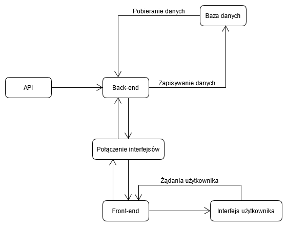

Rysunek 3.1. - Diagram przepływu danych

Część backendowa realizuje poszczególne ze swoich zadań przez zaimplementowane serwisy:

- ApplicationDbService - obsługa bazy danych,
- CryptoService - komunikacja z API Cryptocompare,
- HangFireNotificationService - obserwacja zmian wartości cen kryptowalut i uruchamiania działań z nimi związanych,
- SMTPService - tworzenie wiadomości e-mail wskutek określonych przez użytkowników zmian cen,

> Uwaga: W celu wysyłania wiadomości e-mail użytkownikom konieczne jest skorzystanie z zewnętrznego dostawcy usług w tym zakresie. SMTPService przygotowuje jedynie te wiadomości w formie plików .eml.

Część frontendowa zbudowana jest w oparciu o wzorzec MVC. Kontrolery Summary, Details, Subscriptions, Calculator oraz News wykorzystują specjalne modele utworzone w oparciu o dane otrzymane z części backendowej w przygotowywaniu i sterowaniu widokami.

---

#### Specyfikacja bazy danych

Dane aplikacji przechowywane są w bazie SQL. Komunikacja z bazą i obsługa zapytań po stronie aplikacji realizowana jest przez Microsoft Entity Framework.

Tabele bazy danych logicznie podzielić można na 3 następujące kategorie:

- ##### **Tabele Entity Framework / Identity Framework**:

  - _EFMigrationsHistory,

  - AspNetRoleClaims,

  - AspNetRoles,

  - AspNetUserClaims,

  - AspNetUserLogins,

  - AspNetUserRoles,

  - AspNetUsers,

  - AspNetTokens,

    

  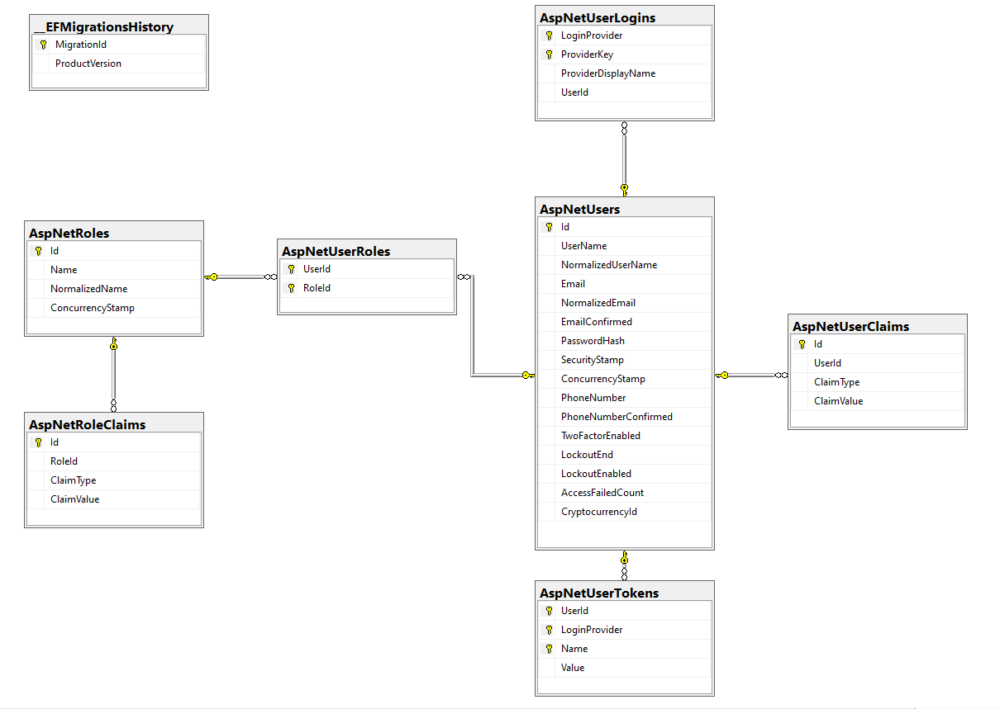

  
Rysunek 3.2. - Diagram tabel Entity Framework / Identity Framework

  

  

- **Tabele reprezentujące modele własne aplikacji**:

  - Conditions - warunki określające, kiedy wysłane powinno zostać powiadomienie,
  - CryptocurrencyUser - tabela techniczna łącząca użytkownika z listą obserwowanych przez niego kryptowalut,
  - Cryptocurrenies - tabela zawierająca sygnatury oraz pełne nazwy kryptowalut,
  - Notifications - tabela zawierająca dane powiadomień,

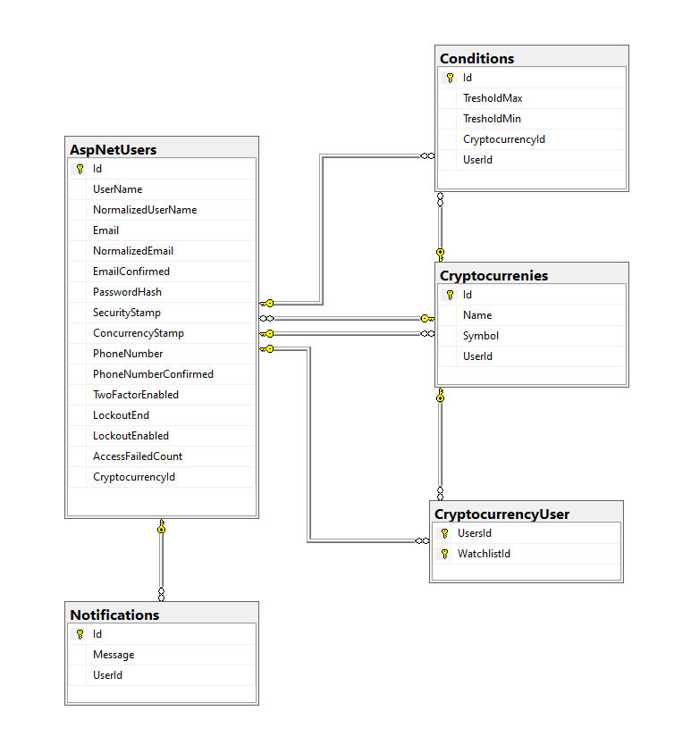

Rysunek 3.3. - Diagram tabel obiektów biznesowych aplikacji 

- **Tabele serwisu HangFire**:
  - HangFire.AggregatedCounter,
  - HangFire.Counter,
  - HangFire.Hash,
  - HangFire.Job,
  - HangFire.JobParameter,
  - HangFire.JobQueue,
  - HangFire.List,
  - HangFire.Schema,
  - HangFire.Server,
  - HangFire.Set,
  - HangFire.State,

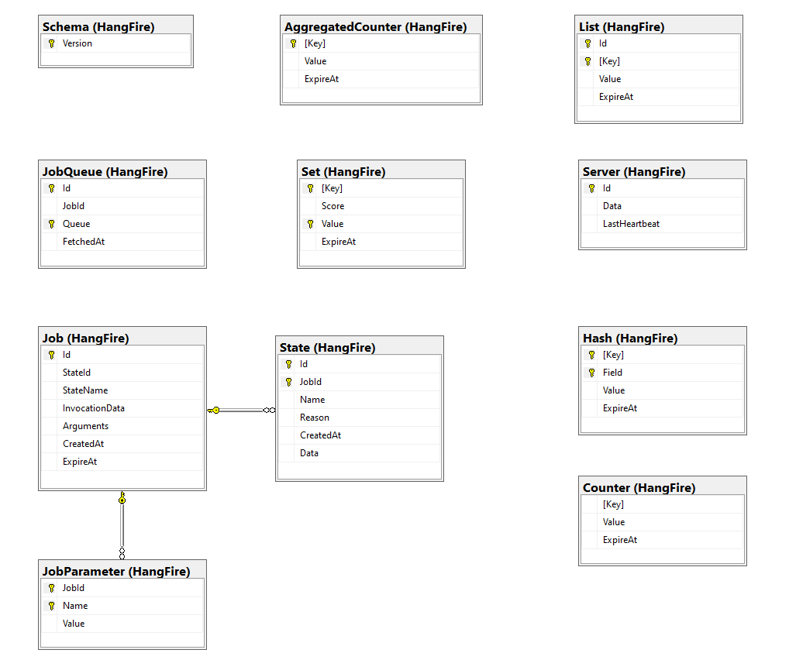

Rysunek 3.4. - Diagram tabel HangFire

---

#### Specyfikacja interfejsu API CryptoCompare i zakresu jego obsługi w aplikacji

CryptoCompare jest serwisem dostarczającym szeroką gamę informacji na temat rynku kryptowalut. Udostąpnia on API pozwalające na pobieranie tych informacji poprzez zapytania. Dokładną dokumentację API CyptoCompare znaleźć można pod adresem: https://min-api.cryptocompare.com/documentation

Każde z zapytań wymaga podania przez klienta klucza uzyskanego w procesie rejestracji na stronie. Zapytania wykonywane są po stronie klienta przez narzędzie HttpUtility.

W ramach klasy-serwisu **CryptoService.cs** zaimplementowano obsługę następujących zapytań:

- pobierania słownika rekordów postaci *Symbol - Nazwa* jako listy dostępnych kryptowalut, objętego metodą **GetCryptoCurrenciesAsync()**,
- pobierania szczegółowych informacji na temat kryptowalut wraz z kursami ich wymiany na walutę tradycyjną objętego metodą **GetCryptocurrenciesInfoAsync(** *string cryptoSymbol* **)**,
- pobierania szczegółowych informacji na temat pojedynczej kryptowaluty wraz z kursem jej wymiany na walutę tradycyjną objętego metodą **GetCryptocurrencyInfoAsync(** *string cryptoSymbol*, *string currencySymbol*),
- pobierania danych historycznych zmian OHLCV (*ang. - Open, High, Low, Close, Volume*) podanej kryptowaluty, objętego metodą **GetHistoricalData(** *[...]* **)**,
- pobierania rankingu najpopularniejszych kryptowalut objętego metodą **GetRankingDataAsync()**,

Adresy API, do których wysyłane są zapytania objęte przez powyższe metody, jak również klucz aplikacji przechowywane są w prywatnych polach klasy **CryptoService**.

---

#### Specyfikacja interfejsu graficznego

Interfejs graficzny zrealizowany został w oparciu o pliki widoków *.cshtml* napisanych z wykorzystaniem składni Razor, co pozwala na sterowanie generowaniem kodu HTML na podstawie odwołań osadzonych w języku C#. Dodatkowo zastosowano bilbliotekę stylów CSS "" i skryptów odpowiedzialnych za animacje elementów. Tak przygotowane strony wysyłane są przez serwer aplikacji i prezentowane użytkownikowi za pośrednictwem przeglądarki.

Podczas odwiedzania dowolnej ze stron wyświetlane są paski nawigacyjne pozwalające użytkownikowi na przechodzenie między poszczególnymi panelami, w tym:

- panelów rejestracji i logowania,
- panelu startowego aplikacji,
- panelu informacji szczegółowych o wybranej kryptowalucie,
- panelu listy obserwowanych kryptowalut (możliwe tylko po zalogowaniu),
- panelu przelicznika kryptowalut,
- panelu kanału wiadomości (RSS),

Interfejs obejmuje następujące strony aplikacji:

1) Stronę startową, przedstawioną na rysunku 3.5.

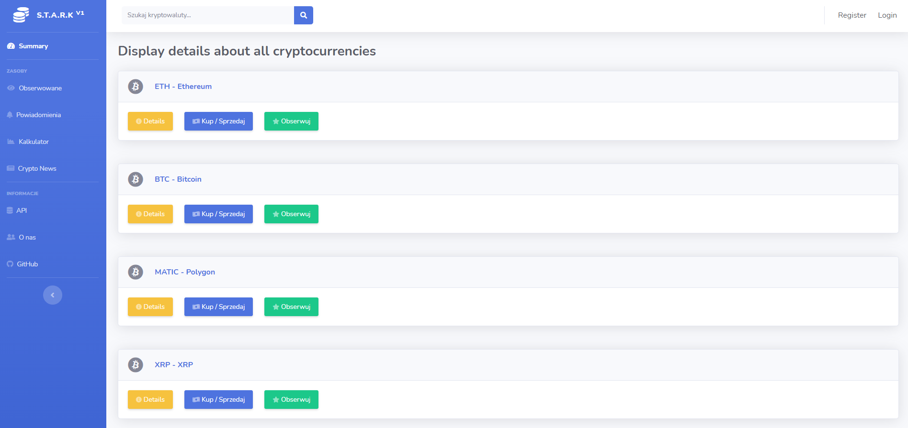

 Rysunek 3.5. - Strona startowa programu 

Po wejściu na stronę wyświetlana jest lista najpopularniejszych w danej chwili kryptowalut. Z tego poziomu użytkownik może, po naciśnięciu przycisku "Details" danej pozycji przejść do strony szczegółowych informacji o danej walucie.

Po wpisaniu frazy w polu wyszukiwania w górnym menu nawigacyjnym lista najpopularniejszych kryptowalut zastąpiona zostaje listą kryptowalut zawierających w nazwie bądź symbolu wpisaną przez użytkownika frazę.

2) Stronę logowania, przedstawioną na rysunku 3.6.

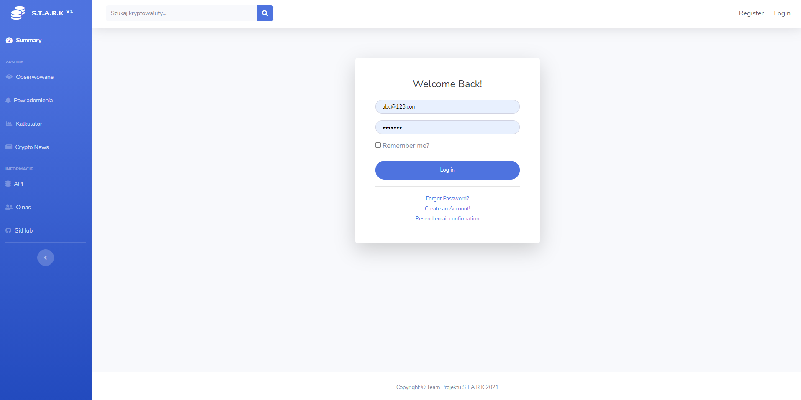

 Rysunek 3.6. - Strona logowania 

Za pośrednictwem tej strony użytkownik posiadający konto może zalogować się w aplikacji, uzyskując dostęp do wszystkich jej funkcjonalności. Jeśli nie posiada konta, może również przejść do rejestracji.

3) Stronę rejestracji, przedstawioną na rysunku 3.7.

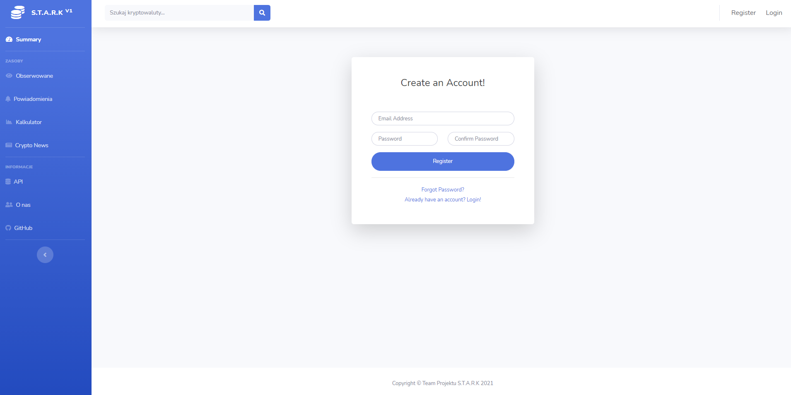

 Rysunek 3.7. - Strona rejestracji 

Za pośrednictwem tej strony użytkownik może utworzyć konto w aplikacji podając wymagane przez formularz informacje.

4) Stronę danych szczegółowych wybranej kryptowaluty, przedstawioną na rysunku 3.8.

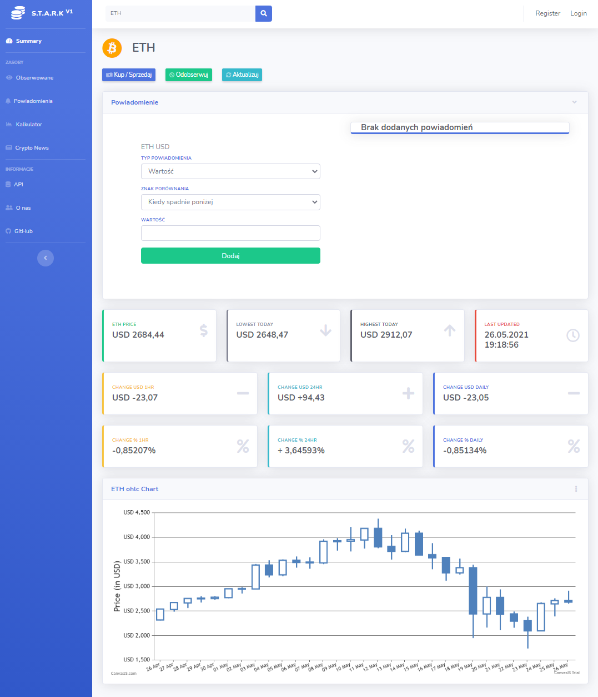

 Rysunek 3.8. - Strona informacji szczegółowych 

Dostęp do tej strony użytkownik może uzyskać poprzez:

- przycisk "Details" jednej z pozycji listy najpopularniejszych kryptowalut,
- przycisk "Details" jednej z pozycji listy będącej otrzymanej w wyniku skorzystania z pola wyszukiwania na górnym pasku,
- przycisk "Details" jednej z pozycji z listy wyświetlanej na stronie "Subscriptions" (dostępna tylko dla użytkowników zalogowanych, omówiona w dalszej części).

Strona szczegółowych informacji daje każdemu użytkownikowi wgląd w takie informacje, jak aktualna cena kryptowaluty, zmiana jej jako wartości pieniężnej oraz procentowej w różnych okresach czasu oraz czas ostatniej aktualizacji wspomnianych informacji. Na wykresie przedstawiane są natomiast wartości *Open, High, Low, Close* ceny kryptowaluty z dni poprzedzających wizytę na stronie.

Użytkownicy zalogowani mają ponadto możliwość skonfigurowania powiadomień związanych z przekroczeniem pewnej wartości (powyżej/poniżej) ceny kryptowaluty. Użytkownicy niezalogowani w przypadku chęci skorzystania z tej funkcjonalności przekierowani zostaną automatycznie na ekran logowania.

5) Stronę obserwowanych kryptowalut, przedstawioną na rysunku 3.9.

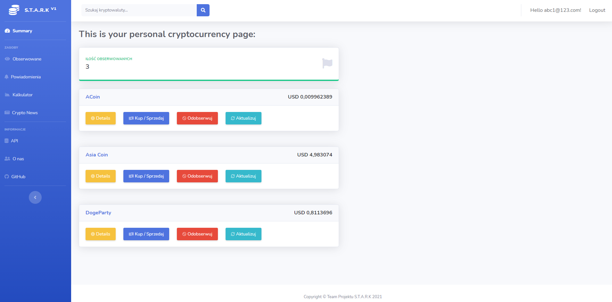

 Rysunek 3.9. - Strona obserwowanych kryptowalut 

Dostęp do tej strony posiadają jedynie użytkownicy zalogowani. Posiada ona listę zawierającą jedynie kryptowaluty dodane przez użytkownika za pomocą przycisku "Obserwuj", z poziomu strony startowej lub danych szczegółowych. Każda z pozycji listy jest wzbogacona o aktualną cenę kryptowaluty. Podobnie, jak w przypadku strony startowej, naciśnięcie przycisku "Details" dowolnej z pozycji przekieruje użytkownika na stronę danych szczegółowych.

Kryptowalutę z listy obserwowanych użytkownik może usunąć poprzez naciśnięcie przycisku "Odobserwuj".

6) Stronę przelicznika kryptowalut, przedstawioną na rysunku 3.10.

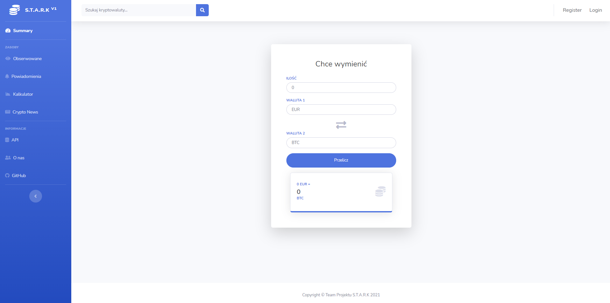

 Rysunek 3.10. - Strona przelicznika kryptowalut 

Dostęp do strony uzyskać może każdy użytkownik, po wybraniu zakładki "Kalkulator" z bocznego paska nawigacyjnego.

Po wpisaniu interesujących użytkownika wartości w pola formularza; odpowiednio: ilości, kryptowaluty, docelowej waluty tradycyjnej, zostanie wyświetlony wynik przeliczenia.

7) Stronę wiadomości, przedstawioną na rysunku 3.11.

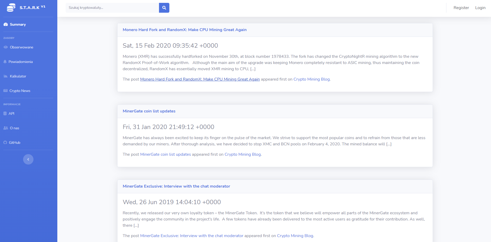

 Rysunek 3.11. - Strona wiadomości na temat kryptowalut 

Dostęp do strony uzyskać może każdy użytkownik po wybraniu zakładki "Crypto News" z bocznego paska nawigacyjnego.

---

### 4. Opis wersji systemu

#### 4.1. Struktura katalogowa projektu

Branch **main** repozytorium ZPP2_STARK zawiera:

Pliki:

- STARK_Project.sln - plik rozwiązania środowiska Visual Studio,
- README.md - plik zawierający krótki opis i wskazujący najistotniejsze elementy repozytorium,
- specyfikacja.md - plik zawierający specyfikację projektu,
- dokumentacja.md - plik zawierający dokumentację projektu,
- .gitignore oraz .gitattributes - pliki obsługi repozytorium,

Foldery:

- STARK_Project - folder zawierający pliki środowiska oraz kod projektu,
- docimages - folder zawierający obrazy wykorzystane w dokumentacji,

Główny folder rozwiązania (STARK_Project) zawiera:

Foldery:

- Areas/Identity - folder zawierający pliki obsługi użytkowników,
- Calculator - folder zawierający implementację kalkulatora kryptowalut,
- Controllers - folder zawierający pliki kontrolerów projektu, w tym:
  - CalculatorController - kontroler kalkulatora,
  - DetailsController - kontroler obsługujący wyświetlanie szczegółowych danych kryptowalut,
  - NewsController - kontroler obsługi strumienia RSS,
  - SubscriptionsController - kontroler obsługi list obserwowanych kryptowalut użytkowników,
  - SummaryController - kontroler obsługi strony głównej programu,
- CryptoAPIService - folder zawierający interfejs oraz implementację serwisu pozyskującego informacje o kryptowalutach z API,
- CryptoApiModel - folder zawierający pliki klas wykorzystywanych do przechowywania danych pozyskanych z API,
- DBServices - folder zawierający interfejs oraz implementację serwisu obsługi bazy danych,
- Data/Migrations - folder zawierający pliki zmian-migracji bazy danych,
- DatabaseModel - folder zawierający pliki klas-encji bazy danych,
- EmailServices - folder zawierający interfejs oraz implementację serwisu obsługi wiadomości email,
- Models - folder zawierający pliki klas wykorzystywanych do komunikacji kontrolerów z widokami,
- NotificationServices - folder zawierający interfejs oraz implementację serwisu obsługi powiadomień,
- Properties - folder zawierający pliki .json obejmujące konfiguracje zależności i uruchamiania,
- Views - folder zawierający pliki widoków dla każdego z kontrolerów,
- wwwroot - folder zawierający pliki statyczne strony (css, js, bootstrap, jquery, czcionki),

Pliki:

- Program.cs oraz Startup.cs - pliki wykorzystywane podczas uruchamiania programu,
- STARK_Project.csproj - plik głównego projektu programu,
- ScaffoldingReadMe.txt - plik readme generowany przez Entity Framework,
- appsettings.Development.json oraz appsettings.json - pliki konfiguracyjne programu,

---

#### 4.2. Zależności

Do zależności projektu należą następujące pakiety NuGet:

- Hangfire.MemoryStorage,
- Hangfire.SqlServer,
- Microsoft.AspNetCore.Identity,
- Microsoft.EntityFrameworkCore,
- Newtonsoft.Json,

Dodatkowo - do zależności testu należą pakiety:

- Microsoft.NET.Test.Sdk,
- NUnit,
- NUnit3TestAdapter,
- Selenium.WebDriver,
- Selenium.WebDriver.GeckoDriver,
- coverlet.collector,
- MSTest.TestFramework,

---

### 5. Testy systemu

Branch "**tests**" repozytorium zawiera aktualną wersję projektu obecną w branchu "**main**" uzupełnioną o projekty zawierające testy aplikacji:

- STARK_SeleniumTests - folder zawierający kod testów zrealizowanych przy wykorzystaniu Selenium,
- STARK_UnitTests - folder zawierający kod testów jednostkowych,

