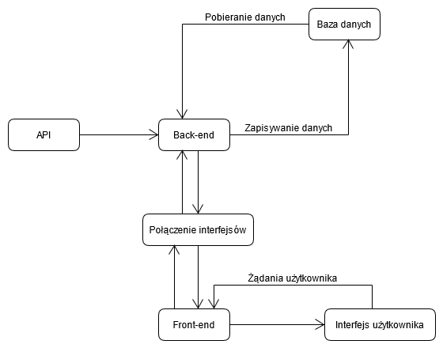

## Specyfikacja wymagań projektu

### Program analizy rynku kryptowalut

Wersja: 1.0

Autor: Natan Jodkowski

---

### Spis treści

1. Wprowadzenie

   1.1. Opis systemu

   1.2. Słownik pojęć

2. Model procesów biznesowych

   2.1. Obiekty biznesowe

   2.2. Aktorzy biznesowi

3. Wymagania funkcjonalne

4. Wymagania niefunkcjonalne

5. Model systemu

   5.1. Diagram przypadków użycia
   
   5.2. Diagram przepływu danych
   
   5.3. Opis architektury i technologii projektu
   
   

---

### 1. Wprowadzenie

#### 1.1. Opis systemu

Celem jest utworzenie platformy dla osób inwestujących i zainteresowanych rynkiem kryptowalut. Jej zadaniem jest przedstawianie w przejrzysty i obrazowy sposób zmian wartości poszczególnych kryptowalut w czasie w oparciu o jak najaktualniejsze informacje. Ponadto, platforma udostępniać ma narzędzia do przeliczania kryptowalut na waluty tradycyjne, w oparciu o aktualne kursy, co pozwoli na szybką analizę stanu obecnych i planowanych inwestycji.

Po wyszukaniu na platformie danej kryptowaluty użytkownikowi prezentowane będzie zestawienie informacji na jej temat, takich jak: wykresy ukazujące w czytelny sposób zmiany cen, podsumowanie najistotniejszych cech waluty (aktualna cena, odnotowana zmiana w przeciągu 24h; najniższa i najwyższa wartość). Użytkownik posiadający konto na platformie będzie mógł utworzyć osobistą listę obserwowanych kryptowalut, dzięki czemu interesujące go informacje będą łatwo dostępne od chwili zalogowania się.

Użytkownicy posiadający konto będą ponadto mogli skonfigurować dostosowane do swoich potrzeb powiadomienia związane z określonymi przez siebie ruchami określonych kryptowalut, jak na przykład przekroczenie pewnego progu cenowego. Program komponować będzie adekwatne wiadomości e-mail, które będą mogły być wysyłane za pośrednictwem zewnętrznego dostawcy usług poczty elektronicznej.

Prosty w obsłudze, intuicyjny interfejs prezentujący w przejrzysty sposób interesujące użytkownika informacje ma uczynić projektowaną platformę efektywnym narzędziem porównawczym ułatwiającym użytkownikowi podejmowanie decyzji inwestycyjnych na rynku kryptowalut.

#### 1.2. Słownik pojęć

- **Kryptowaluta** - pojęcie funkcjonujące w platformie, stanowi reprezentację wszystkich informacji związanych z kryptowalutą obecną na rynku,
- **Lista obserwowanych** - pojęcie funkcjonujące w platformie, jest bytem grupującym kryptowaluty dodane przez użytkownika do osobistej listy "szybkiego dostępu",
- **Platforma** - strona internetowa posiadająca opisaną funkcjonalność,
- **Użytkownik tymczasowy** - osoba odwiedzające stronę, nie posiadająca konta,
- **Użytkownik zarejestrowany** - osoba korzystająca z platformy, posiadająca konto ale nie zalogowana,
- **Użytkownik zalogowany** - osoba korzystająca z platformy, zalogowana na konto utworzone w procesie rejestracji,

---

### 2. Model procesów biznesowych

#### 2.1. Obiekty biznesowe

| Nazwa: | Kryptowaluta                                                 |
| ------ | ------------------------------------------------------------ |
| Opis:  | Zestawienie informacji dotyczących pojedynczej kryptowaluty. Posiada sygnaturę (skrótową nazwę jednoznacznie identyfikującą ją na rynku), pełną nazwę, wartość pojedynczej jednostki, wolumen, wartości najniższą i najwyższą odnotowane w przeciągu ostatnich 24 godzin od chwili podglądu. |

| Nazwa: | Lista obserwowanych                                          |
| ------ | ------------------------------------------------------------ |
| Opis:  | Kolekcja kryptowalut wybranych przez użytkownika jako "obserwowanych". Stanowi przykład "listy szybkiego dostępu" - wyświetlanej zaraz po wejściu użytkownika zalogowanego na stronę. Wybór pozycji z tej listy ma kierować użytkownika do panelu podglądu informacji o danej kryptowalucie. |

| Nazwa: | Kalkulator walutowy                                          |
| ------ | ------------------------------------------------------------ |
| Opis:  | Wewnętrzny serwis platformy, umożliwiający przeliczanie wartości kryptowalut względem walut tradycyjnych, w oparciu o aktualne kursy. |

#### 2.2. Aktorzy biznesowi

| Nazwa: | Użytkownik tymczasowy                                        |
| ------ | ------------------------------------------------------------ |
| Opis:  | Użytkownik platformy, odwiedzający stronę, nie posiadający konta. Dane na temat jego wizyty nie są zapisywane. Może przeglądać udostępniane przez platformę zasoby, nie ma jednak możliwości utworzenia osobistej listy obserwowanych kryptowalut i dodawania do niej pozycji, jak i otrzymywania powiadomień. |

| Nazwa: | Użytkownik zalogowany                                        |
| ------ | ------------------------------------------------------------ |
| Opis:  | Użytkownik platformy, posiadający konto, na którym jest obecnie zalogowany. Posiada dostęp do wszystkich funkcjonalności platformy; może przeglądać udostępniane przez platformę zasoby, edytować osobistą listę obserwowanych kryptowalut oraz konfigurować funkcję otrzymywania powiadomień. |

---

### 3. Wymagania funkcjonalne

| ID:        | 1                                                            |
| ---------- | ------------------------------------------------------------ |
| Nazwa:     | Przegląd kryptowalut                                         |
| Priorytet: | WYSOKI                                                       |
| Rola:      | WSZYSCY                                                      |
| Opis:      | Aplikacja oferuje przegląd listy kryptowalut obecnych na platformie. |

| ID:        | 2                                                            |
| ---------- | ------------------------------------------------------------ |
| Nazwa:     | Wyszukiwanie kryptowalut                                     |
| Priorytet: | WYSOKI                                                       |
| Rola:      | WSZYSCY                                                      |
| Opis:      | Aplikacja oferuje możliwość wyszukania danej kryptowaluty na podstawie jej nazwy bądź sygnatury bez konieczności przeglądania listy. |

| ID:        | 3                                                            |
| ---------- | ------------------------------------------------------------ |
| Nazwa:     | Wyświetlanie szczegółowych informacji o danej kryptowalucie  |
| Priorytet: | WYSOKI                                                       |
| Rola:      | WSZYSCY                                                      |
| Opis:      | Każdy użytkownik platformy po wybraniu z poziomu przeglądania (użytkownicy zalogowani również poprzez wybór z listy szybkiego dostępu) danej kryptowaluty uzyskuje podgląd szczegółowych informacji na jej temat; wartości cenowych, zarejestrowanych zmian (w postaci kwoty i wartości procentowej) w przeciągu ostatniej godziny, doby, przebiegu zmian ceny w postaci wykresu. |

| ID:        | 4                                                            |
| ---------- | ------------------------------------------------------------ |
| Nazwa:     | Podawanie informacji o czasie ostatniej aktualizacji kursu   |
| Priorytet: | WYSOKI                                                       |
| Rola:      | WSZYSCY                                                      |
| Opis:      | W ramach wyświetlania szczegółowych danych dotyczących konkretnej kryptowaluty (wymaganie ID: 3) wyświetlana jest również informacja o czasie ostatniego zaktualizowania informacji na jej temat. |

| ID:        | 5                                                            |
| ---------- | ------------------------------------------------------------ |
| Nazwa:     | Utworzenie konta                                             |
| Priorytet: | WYSOKI                                                       |
| Rola:      | Użytkownicy tymczasowi                                       |
| Opis:      | Osoba odwiedzająca platformę ma możliwość utworzenia konta (zarejestrowania się) tym samym zmieniając swoją rolę i uzyskując dostęp do wszystkich funkcjonalności platformy. |

|  ID:    | 6 |
| ---- | ---- |
|Nazwa:      | Logowanie użytkownika |
|Priorytet:     | WYSOKI |
|Rola:      | Użytkownicy zarejestrowani |
|Opis:      | Na podstawie danych dostarczonych podczas rejestracji (wymaganie ID: 5) użytkownik ma możliwość zalogowania się do aplikacji. |

| ID:        | 7                                                            |
| ---------- | ------------------------------------------------------------ |
| Nazwa:     | Dodanie kryptowaluty do listy obserwowanych                  |
| Priorytet: | WYSOKI                                                       |
| Rola:      | Użytkownicy zalogowani                                       |
| Opis:      | Z poziomu przeglądania/wyszukiwania kryptowalut platformy użytkownik zalogowany ma możliwość dodawania wybranych przez siebie kryptowalut do listy obserwowanych. |

| ID:        | 8                                                            |
| ---------- | ------------------------------------------------------------ |
| Nazwa:     | Usunięcie kryptowaluty z listy obserwowanych                 |
| Priorytet: | WYSOKI                                                       |
| Rola:      | Użytkownicy zalogowani                                       |
| Opis:      | Użytkownik zalogowany ma możliwość usuwania pozycji z listy obserwowanych kryptowalut. |

| ID:        | 9                                                            |
| ---------- | ------------------------------------------------------------ |
| Nazwa:     | Konfiguracja i włączenie powiadomień mailowych               |
| Priorytet: | WYSOKI                                                       |
| Rola:      | Użytkownicy zalogowani                                       |
| Opis:      | Po wyborze określonej kryptowaluty z listy obserwowanych użytkownik ma możliwość wyboru i włączania/wyłączania powiadomień mailowych o zmianach jej wartości. Użytkownik ma możliwość określenia rodzaju i skali zmian, o których chce być powiadomiony oraz dopuszczalnej częstotliwości otrzymywania powiadomień. |

| ID:        | 10                                                           |
| ---------- | ------------------------------------------------------------ |
| Nazwa:     | Przeliczanie kryptowalut na waluty tradycyjne                |
| Priorytet: | WYSOKI                                                       |
| Rola:      | Użytkownicy zalogowani                                       |
| Opis:      | Użytkownik ma możliwość przeliczania wartości kryptowalut na dane waluty tradycyjne, za pomocą dostarczonego przez platformę kalkulatora. |

---

### 4. Wymagania niefunkcjonalne

| ID:        | 1                                                            |
| ---------- | ------------------------------------------------------------ |
| Nazwa:     | Aktualność informacji                                        |
| Priorytet: | WYSOKI                                                       |
| Opis:      | Prezentowane użytkownikowi dane na temat kryptowalut powinny być w miarę możliwości często aktualizowane. |

| ID:        | 2                                                            |
| ---------- | ------------------------------------------------------------ |
| Nazwa:     | Podział odpowiedzialności systemu                            |
| Priorytet: | WYSOKI                                                       |
| Opis:      | Platforma ma być podzielona na część frontendową i backendową. Komunikacja pomiędzy tymi elementami powinna w głównej mierze odbywać się przez interfejsy lub klasy przeznaczone realizowaniu tej komunikacji. |

| ID:        | 3                                                            |
| ---------- | ------------------------------------------------------------ |
| Nazwa:     | Łatwość obsługi                                              |
| Priorytet: | WYSOKI                                                       |
| Opis:      | Główną zaletą platformy ma być łatwość obsługi, umożliwiająca sprawne przeprowadzanie przez użytkownika przeglądu informacji i kalkulacji cen. |

| ID:        | 4                                                            |
| ---------- | ------------------------------------------------------------ |
| Nazwa:     | Przejrzystość interfejsu                                     |
| Priorytet: | WYSOKI                                                       |
| Opis:      | Interfejs graficzny użytkownika powinien charakteryzować się przejrzystością eliminując konieczność zapoznawania użytkownika z dodatkowymi instrukcjami obsługi. |

| ID:        | 5                                                            |
| ---------- | ------------------------------------------------------------ |
| Nazwa:     | Responsywność interfejsu graficznego                         |
| Priorytet: | WYSOKI                                                       |
| Opis:      | Platforma powinna być dostosowana do wyświetlania zawartości na urządzeniach niezależnie od rozdzielczości wyświetlacza, zachowując w jak największym stopniu przejrzystość i intuicyjność interfejsu. |

| ID:        | 6                                                            |
| ---------- | ------------------------------------------------------------ |
| Nazwa:     | Szata graficzna interfejsu                                   |
| Priorytet: | ŚREDNI                                                       |
| Opis:      | Wskazane jest zaprojektowanie szaty graficznej interfejsu pod kątem wyraźnego zaznaczania istotnych informacji, ale również zastosowania gamy barw i proporcji elementów sprawiających wrażenie spójnego, przyjaznego wizerunku platformy. |

---

### 5. Model systemu

#### 5.1. Diagram przypadków użycia

 Rysunek 1. - Diagram przypadków użycia 

#### 5.2. Diagram przepływu danych

 Rysunek 2. - Diagram przepływu danych 

#### 5.3. Opis architektury i technologii projektu

Frontend: wykonany na platformie ASP.NET, zgodnie ze wzorcem MVC (Model-View-Controller).  

Widoki (interfejs użytkownika) wykonane z wykorzystaniem HTML i CSS (biblioteka Bootstrap) komunikujące się z kontrolerami za pomocą składni Razor (integracji C# wewnątrz strony html,  w plikach .cshtml), uzupełniane w miarę potrzeb skryptami Javascript/Jquery.

Główne API dostarczające dane aplikacji: CryptoCompare.

Backend: silnik aplikacji wykonany w języku C#. Odpowiedzialny za komunikację z API serwisów  dostarczających informacje o kursach kryptowalut, selekcję oraz formatowanie danych i komunikację z bazą danych

Przewidywane implementacje wzorców projektowych:

- **Factory** - pozwala na stworzenie systemu dynamicznie tworzącego i dostarczającego instancje klas,
- **Adapter** - pozwala na działanie dwóch kolidujących interfejsów, potencjalnie przydatny w ramach opracowywania mechanizmów komunikacji frontendu programu z backendem,
- **Decorator** - pozwala na rozwinięcie klasy bez ingerencji w jej implementację, potencjalne wykorzystanie w przypadku wprowadzania dodatkowych funkcjonalności w trakcie pracy nad projektem,
- **Observer** - pozwala na nadzorowanie zmian stanu obiektów i powiadamianie o nich obiektów zależnych, potencjalne wykorzystanie w ramach opracowywania systemu powiadomień użytkownika o zmianach kursów,
- **Dependency Injection** - pozwala na tworzenie kodu o luźniejszych powiązaniach (ang. *loose coupling*), ułatwiającym testowanie i modyfikacje,
- **Model-View-Controler** - wzorzec architektoniczny organizujący strukturę aplikacji o graficznym interfejsie użytkownika w trzy główne części: "Model", "Widok" oraz "Kontroler",